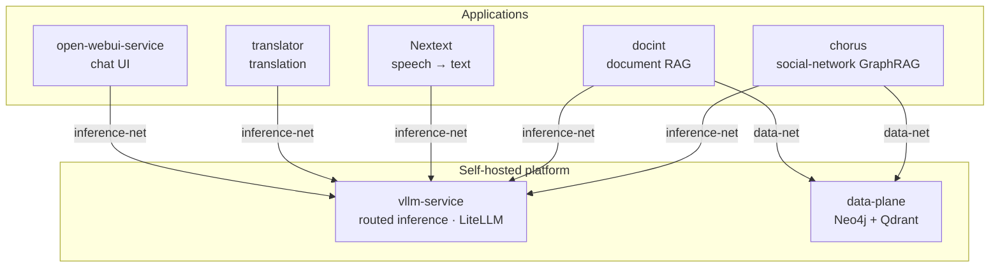

> **nos-tromo** — self-hosted NLP & OSINT tooling: transcription, translation, document and social-network intelligence, all running on hardware you control.

I build a small **federation** of analysis apps that share one self-hosted, OpenAI-compatible inference stack. Everything is designed to run on-prem or fully **air-gapped** — no data leaves the box, all model weights sit behind a single routed endpoint, and the apps stay stateless so their state lives in exactly one place.

**Built with:** Python · FastAPI · React · Streamlit · Docker Compose · vLLM · LiteLLM · Neo4j · Qdrant · `uv` · strict `ruff` + `mypy`

### How it fits together

### Platform

| Repo | What it does |
|---|---|
| **[vllm-service](https://github.com/nos-tromo/vllm-service)** | One LiteLLM-fronted, OpenAI-compatible endpoint multiplexing chat, embeddings, rerank, NER (GLiNER), CLIP, Whisper ASR, diarization & VAD — with CPU-only single-service shapes and offline bundles for air-gapped hosts. |
| **[data-plane](https://github.com/nos-tromo/data-plane)** | Stateful backbone: owns the Neo4j (graph + native vectors) and Qdrant (document vectors) volumes so the apps stay disposable. |
| **[open-webui-service](https://github.com/nos-tromo/open-webui-service)** | Open WebUI chat frontend, deployed against the shared inference stack. |

### Applications

| Repo | What it does |
|---|---|
| **[chorus](https://github.com/nos-tromo/chorus)** | GraphRAG for social-network analysis on Neo4j — versioned Cypher retrieval tools, a natural-language tool-calling agent, entity resolution, and §76 BDSG audit logging. |
| **[docint](https://github.com/nos-tromo/docint)** | Document-intelligence RAG — FastAPI + React SPA over Qdrant, hybrid & graph retrieval, entity resolution, server-streamed CSV exports. |
| **[Nextext](https://github.com/nos-tromo/Nextext)** | Transcribe, translate & analyze speech from audio/video — all inference on external endpoints, no local GPU or bundled weights. |
| **[translator](https://github.com/nos-tromo/translator)** | Self-hosted translation service powered by TranslateGemma — FastAPI API + Streamlit UI, ~100 languages. |

### Engineering glue

| Repo | What it does |
|---|---|
| **[.github](https://github.com/nos-tromo/.github)** | Org-wide CI: reusable GitHub Actions workflows, the canonical strict `ruff`/`mypy` config every consumer must mirror, and the dependabot template. |

### Other public projects

- **[babel](https://github.com/nos-tromo/babel)** — Arabic dialect identification.
- **[hatespeech-detect](https://github.com/nos-tromo/hatespeech-detect)** — hate-speech classification workflow.
