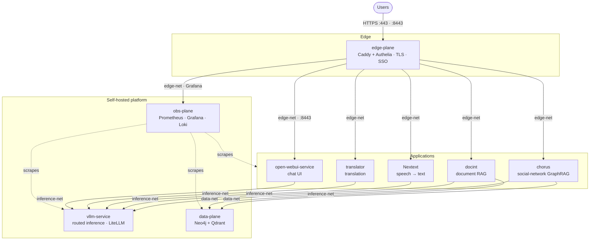

> **nos-tromo** — self-hosted NLP & OSINT tooling: transcription, translation, document and social-network intelligence, all running on hardware you control.

I build a small **federation** of analysis apps that share one self-hosted, OpenAI-compatible inference stack. Everything is designed to run on-prem or fully **air-gapped** — no data leaves the box, all model weights sit behind a single routed endpoint, the apps stay stateless so their state lives in exactly one place, and users reach every app through a single authenticated gateway.

**Built with:** Python · FastAPI · TypeScript · React · Tailwind · Docker Compose · vLLM · LiteLLM · Neo4j · Qdrant · Prometheus · Grafana · Loki · Caddy · Authelia · `uv` · strict `ruff` + `pyrefly`

### How it fits together

```mermaid
flowchart TB
  users(["Users"])

  subgraph Edge["Edge"]
    edge["edge-plane<br/>Caddy + Authelia · TLS · SSO"]
  end

  subgraph Apps["Applications"]
    chorus["chorus<br/>social-network GraphRAG"]
    docint["docint<br/>document RAG"]
    nextext["Nextext<br/>speech → text"]
    translator["translator<br/>translation"]
    webui["open-webui-service<br/>chat UI"]
  end

  subgraph Platform["Self-hosted platform"]
    vllm["vllm-service<br/>routed inference · LiteLLM"]
    data["data-plane<br/>Neo4j + Qdrant"]
    obs["obs-plane<br/>Prometheus · Grafana · Loki"]
  end

  users -->|HTTPS :443 · :8443| edge

  edge -->|edge-net| chorus
  edge -->|edge-net| docint
  edge -->|edge-net| nextext
  edge -->|edge-net| translator
  edge -->|edge-net · :8443| webui
  edge -->|edge-net · Grafana| obs

  chorus -->|inference-net| vllm
  docint -->|inference-net| vllm
  nextext -->|inference-net| vllm
  translator -->|inference-net| vllm
  webui -->|inference-net| vllm

  chorus -->|data-net| data
  docint -->|data-net| data

  obs -.->|scrapes| vllm
  obs -.->|scrapes| data
  obs -.->|scrapes| Apps
```

Three network seams keep the tiers apart — `inference-net` (apps ↔ inference), `data-net` (apps ↔ state), `edge-net` (gateway ↔ app frontends) — and the gateway joins only the last of them. It is also the only member that publishes host ports: `:443`, `:8443` for the chat UI, and `:80` as a redirect.

### Platform

| Repo | What it does |
|---|---|
| **[vllm-service](https://github.com/nos-tromo/vllm-service)** | One LiteLLM-fronted, OpenAI-compatible endpoint multiplexing chat, dense & sparse embeddings, rerank, NER (GLiNER on Ray Serve), CLIP, Whisper transcription & translation, diarization & VAD — plus seven single-service CPU-only shapes and offline bundles for air-gapped hosts. |
| **[data-plane](https://github.com/nos-tromo/data-plane)** | Stateful backbone: owns the Neo4j (graph + native vectors) and Qdrant (document vectors, CPU or CUDA) volumes so the apps stay disposable — with dump/snapshot backup and restore runbooks. |
| **[obs-plane](https://github.com/nos-tromo/obs-plane)** | Airgap-first observability plane — Prometheus, Grafana, Loki and Alloy plus host and container exporters and black-box health probes, all pulled digest-pinned images; dashboards provisioned from files, alerts as committed Prometheus and Loki rules, no runtime fetching or phone-home. |
| **[edge-plane](https://github.com/nos-tromo/edge-plane)** | The federation's single entry point — Caddy (TLS, path routing) + Authelia (forward-auth SSO, file-backed users), the one member that publishes ports at all. Strips client-supplied identity headers, authenticates every request, injects the trusted `X-Auth-User` / `X-Auth-Email` headers the apps consume, and fronts a static portal of service tiles. |
| **[open-webui-service](https://github.com/nos-tromo/open-webui-service)** | Open WebUI chat frontend on a digest-pinned upstream image with every bundled provider disabled — chat, RAG embeddings and speech-to-text all leave through the shared LiteLLM endpoint — served on the gateway's dedicated site with trusted-header SSO. |

### Applications

| Repo | What it does |
|---|---|
| **[chorus](https://github.com/nos-tromo/chorus)** | GraphRAG for social-network analysis on Neo4j — nine schema'd graph tools over version-controlled Cypher, a natural-language tool-calling agent, alias → entity resolution, interactive force-graph exploration, retention timers, and §76 BDSG audit logging. |
| **[docint](https://github.com/nos-tromo/docint)** | Multimodal document-intelligence RAG — FastAPI + React SPA over Qdrant: hybrid retrieval with graph-assisted query expansion, entity resolution, an agent orchestrator, a Report Builder exporting case files (Markdown, HTML, JSON, CSV, PDF), and server-streamed CSV and ZIP extracts. |
| **[Nextext](https://github.com/nos-tromo/Nextext)** | Transcribe, translate, diarize & analyze speech from audio/video — CLI + FastAPI job API + React SPA, with Whisper, LLM, GLiNER, diarization and VAD each on its own external endpoint; no local GPU, no bundled weights. |
| **[translator](https://github.com/nos-tromo/translator)** | Self-hosted translation service — FastAPI API + React SPA over any OpenAI-compatible endpoint, model-agnostic by env, ~50 languages with LLM-based source-language detection, no bundled weights. |

### Engineering glue

<!-- profile:no-diagram -->

| Repo | What it does |
|---|---|
| **[deploy](https://github.com/nos-tromo/deploy)** | Federation lifecycle layer — ordered, health-gated single-host bring-up (inference → state → obs → apps → edge) of the whole stack, delegating to each member's own make/compose, plus a bare-host clone bootstrap, offline bundle and model-weight transfer, and the operator runbooks. |
| **[.github](https://github.com/nos-tromo/.github)** | Org-wide CI + shared build glue: five reusable GitHub Actions workflows (Python app CI, infra validation, Node lib CI, release tagging, `@claude`), the canonical strict `ruff`/`pyrefly` config, the vendored `make/common.mk` + `bundle-lib.sh` + `eslint.config.js` every consumer mirrors, and the commit-SHA pin policy checks — seven drift validators in all, each smoke-tested in CI against aligned and drifted fixtures. |
| **[infra-ui](https://github.com/nos-tromo/infra-ui)** | Shared React design system (`@infra/ui`) — Tailwind v4 tokens, UI primitives (Button, Card, Input, Select, Menu, Badge, Spinner, Banner, …), a drawn icon set, the `AppShell` chrome and a force-graph view with GraphML/HTML export; light by default with dark on an OS preference or the in-app toggle, consumed by the React SPAs as a commit-SHA-pinned pnpm tarball dependency, shipping a committed prebuilt `dist/` for deterministic types across consumers. |

### Other public projects

- **[babel](https://github.com/nos-tromo/babel)** — Arabic dialect identification.
- **[txt2pdf](https://github.com/nos-tromo/txt2pdf)** — text-to-PDF converter with full Unicode support.
