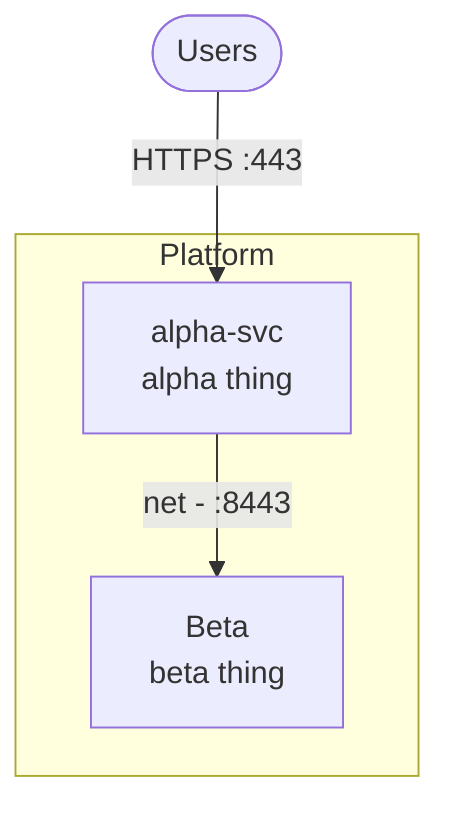

> **demo-org** — fixture landing page for the profile-claims validator.

### Platform

| Repo | What it does |
|---|---|
| **[alpha-svc](https://example.invalid/demo-org/alpha-svc)** | Reads the alpha config and publishes no ports. |
| **[Beta](https://example.invalid/demo-org/Beta)** | Ships two widget modules and a language map of about fifty entries. |

### Engineering glue

<!-- profile:no-diagram -->

| Repo | What it does |
|---|---|
| **[.config](https://example.invalid/demo-org/.config)** | Shared build glue with two callable workflows. |

### Other public projects

- **[sidecar](https://example.invalid/demo-org/sidecar)** — not a federation member.
